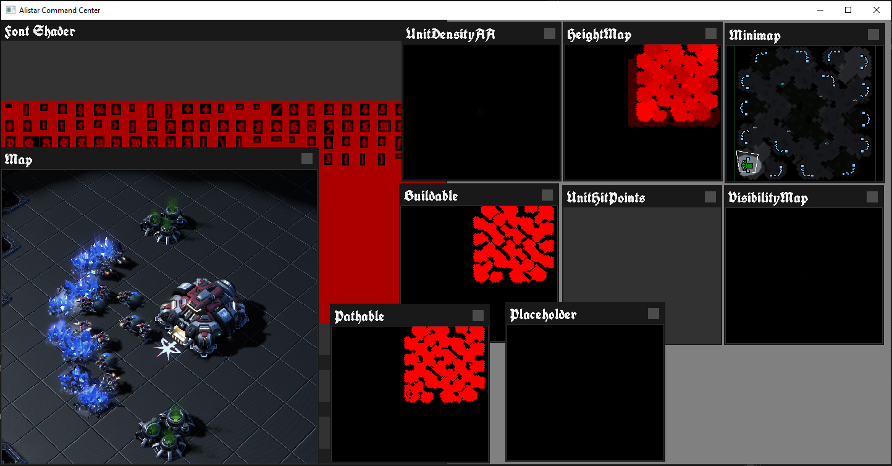

# AliStar
Experimental Standalone StartCraft II Bot API For The C Developer.



## Please note:
- This is not a production ready project, it is simply a way to program
  bots for SC II without having to use the bloated sc2 API.
- This project will only work on Windows ...
## Building
- Clone this project using ```--recursive```
- Find where your ```vcvars64.bat``` or ```vcvars32.bat``` batch files are located:
	For instance, ```D:\Program Files\Microsoft Visual Studio\2022\Community\VC\Auxiliary\Build```
- Setup the environment using either ```vcvars64.bat``` or ```vcvars32.bat```
- cd into alistar, run ```build.msvc.bat```